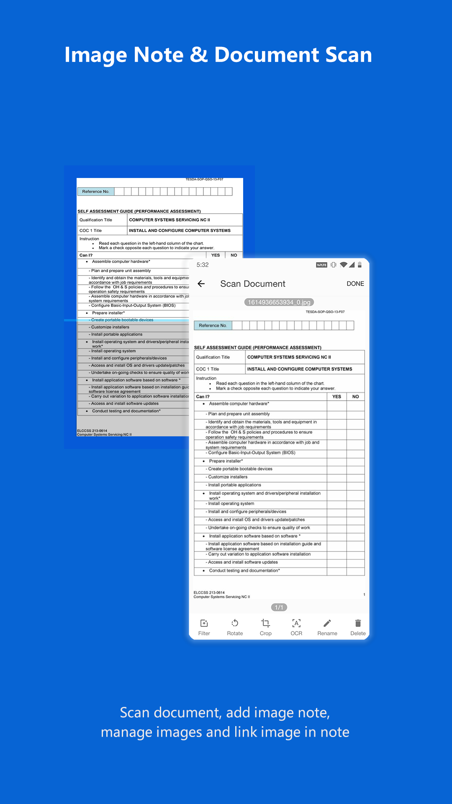

### Hi there 👋

My name is Shouheng Wang, a software engineer:

- 🔭 I’m currently working on my new App **[Leaf Note](https://play.google.com/store/apps/details?id=me.shouheng.leafnote)** 
- 🌱 I’m currently learning FE & flutter & Jetpack compose & C++.
- 💼 My Android development kit: 
    - [Android-VMLib](https://github.com/Shouheng88/Android-VMLib)
    - [iCamera](https://github.com/Shouheng88/iCamera) 
    - [Android-utils](https://github.com/Shouheng88/Android-utils)
    - [Android-uix](https://github.com/Shouheng88/Android-uix)
    - [AndroidStartup](https://github.com/Shouheng88/AndroidStartup)
    - [Compressor](https://github.com/Shouheng88/Compressor)
    - [EasyMark](https://github.com/Shouheng88/EasyMark)
- 🍩 My open source projects: [MarkNote](https://github.com/Shouheng88/MarkNote), [TranslateMyApp](https://github.com/Shouheng88/TranslateMyApp), [OmniList](https://github.com/Shouheng88/OmniList), [SpringBooster](https://github.com/Shouheng88/SpringBooster)
- 📱 My published Apps:
    - **[Leaf Note](https://play.google.com/store/apps/details?id=me.shouheng.leafnote): Connecting phone and desktop, designed for cross platform, the new Mardkwon note-taking application.**
    - [MobileBox](https://play.google.com/store/apps/details?id=me.shouheng.mobilebox): A collection of useful and efficient tools.
    - [WhatsNext](https://play.google.com/store/apps/details?id=me.shouheng.whatsnext): A time and task management App.
    - [MarkNote](https://play.google.com/store/apps/details?id=me.shouheng.notepal): A markdown note-taking application.
- 📫 How to reach me:
    - Email: shouheng2015@gmail.com
    - My Blog: [掘金](https://juejin.im/user/3685218704691469)
    - WeChat Official Accounts: **你好 开发者**

## 👏👏👏 My new product

### LeafNote, connecting phone and computer, designed for cross platform

If you have the requirement for a markdown note-taking application on Android, witch can sync your notes between phone and computer, you can try my new App [Leaf Note](https://play.google.com/store/apps/details?id=me.shouheng.leafnote). Preview images of LeafNote:

**Download**

- GooglePlay: [Leaf Note](https://play.google.com/store/apps/details?id=me.shouheng.leafnote)
- CoolApk market: [言叶 —— 为跨平台而设计的 Markdown 笔记应用](http://www.coolapk.com/apk/280001).
