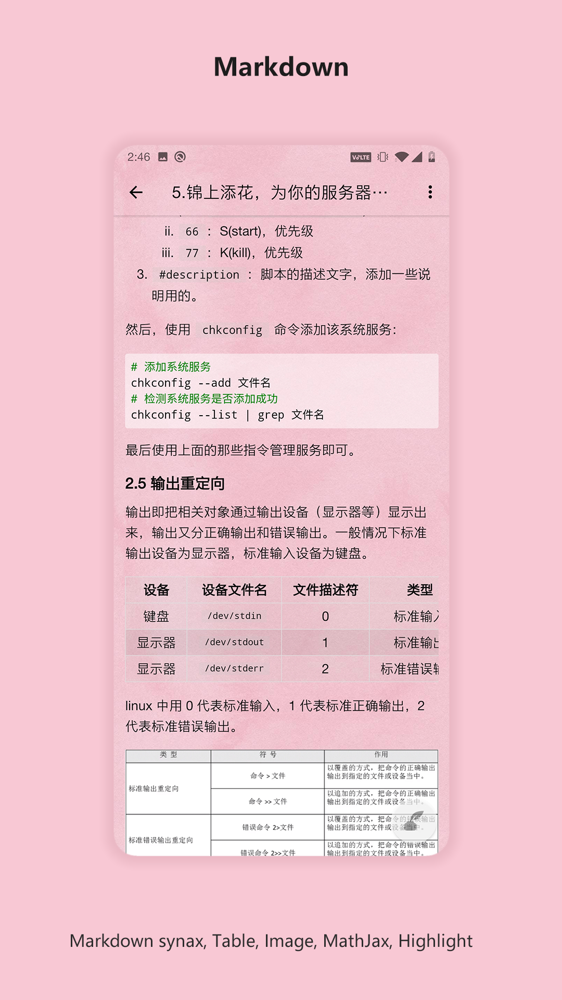
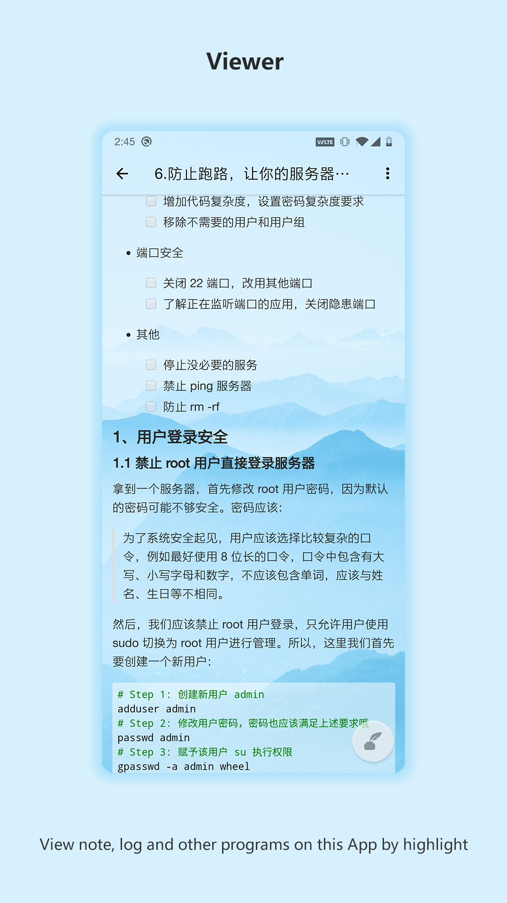
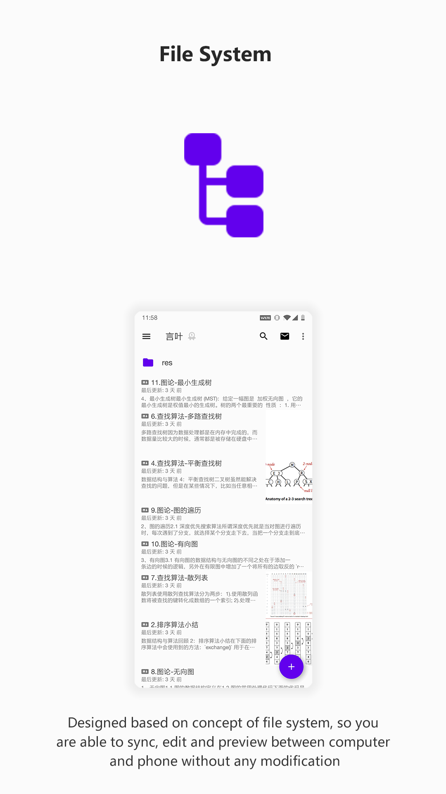
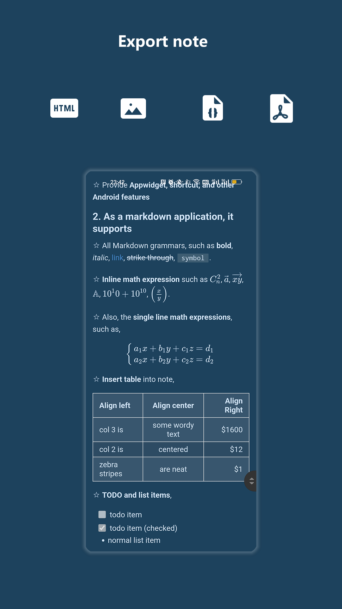
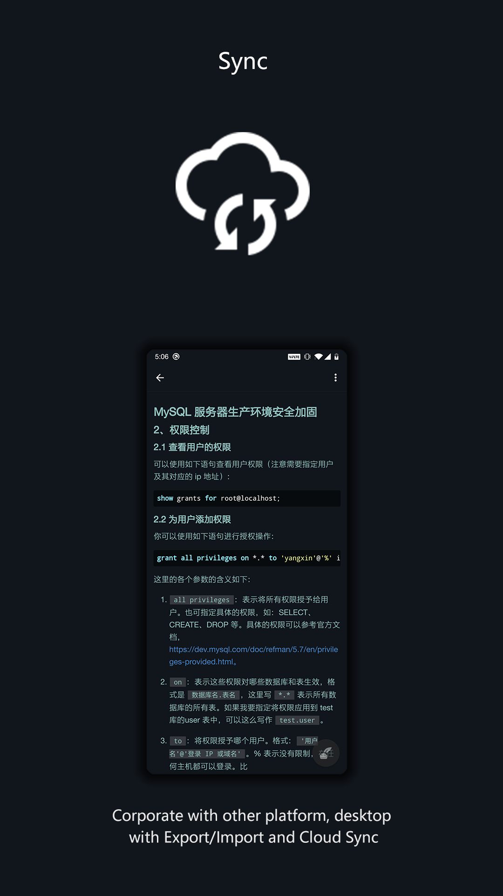
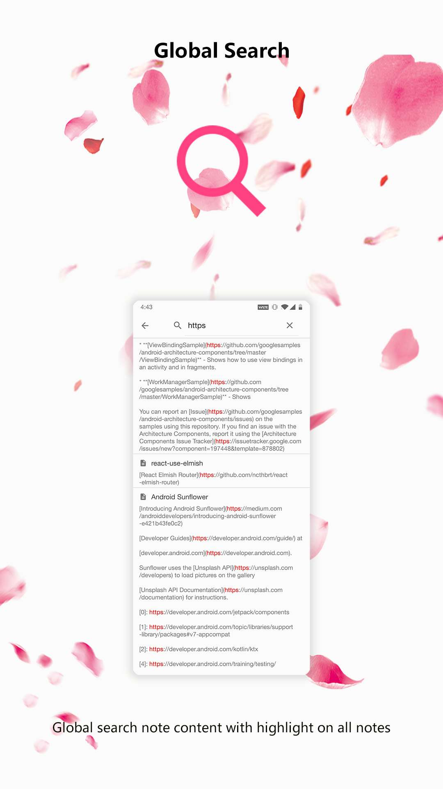
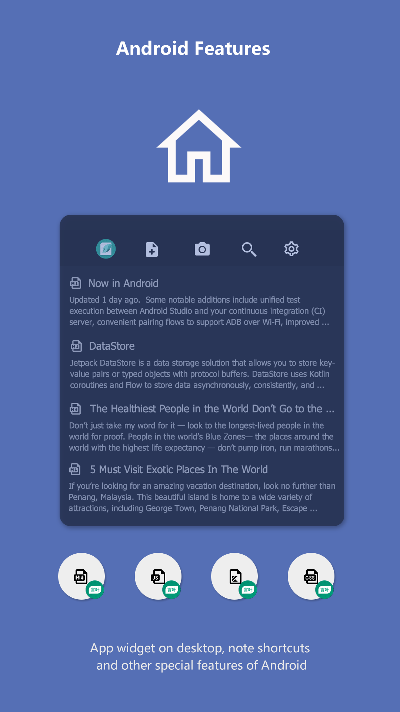

### Hi there 👋

My name is Shouheng Wang, a software engineer:

- 🔭 I’m currently working on my new App **[Leaf Note](https://play.google.com/store/apps/details?id=me.shouheng.leafnote)** & [MobileBox](https://play.google.com/store/apps/details?id=me.shouheng.mobilebox) and writing some blogs.
- 🌱 I’m currently learning FE, flutter & Python crawler.
- 💼 My Android development kit: [Android-VMLib](https://github.com/Shouheng88/Android-VMLib), [iCamera](https://github.com/Shouheng88/iCamera), [Android-utils](https://github.com/Shouheng88/Android-utils), [Android-uix](https://github.com/Shouheng88/Android-uix), [Compressor](https://github.com/Shouheng88/Compressor), [EasyMark](https://github.com/Shouheng88/EasyMark)
- 🍩 My open source projects: [MarkNote](https://github.com/Shouheng88/MarkNote), [TranslateMyApp](https://github.com/Shouheng88/TranslateMyApp), [OmniList](https://github.com/Shouheng88/OmniList)
- 📱 My published Apps:
    - **[Leaf Note](https://play.google.com/store/apps/details?id=me.shouheng.leafnote): Connecting phone and desktop, designed for cross platform, the new Mardkwon note-taking application.**
    - [MobileBox](https://play.google.com/store/apps/details?id=me.shouheng.mobilebox): A collection of useful and efficient tools.
    - [MarkNote](https://play.google.com/store/apps/details?id=me.shouheng.notepal): A markdown note-taking application.
- 📫 How to reach me:
    - Email: shouheng2015@gmail.com
    - My Blog: [掘金](https://juejin.im/user/3685218704691469)
    - WeChat Official Accounts: **Hello 开发者**

### LeafNote, connecting phone and computer, designed for cross platform

If you have the requirement for a markdown note-taking application on Android, witch can sync your notes between phone and computer, you can try my new App [Leaf Note](https://play.google.com/store/apps/details?id=me.shouheng.leafnote). Preview images of LeafNote:

or you can download from CoolApk market: [言叶 —— 为跨平台而设计的 Markdown 笔记应用](http://www.coolapk.com/apk/280001).
