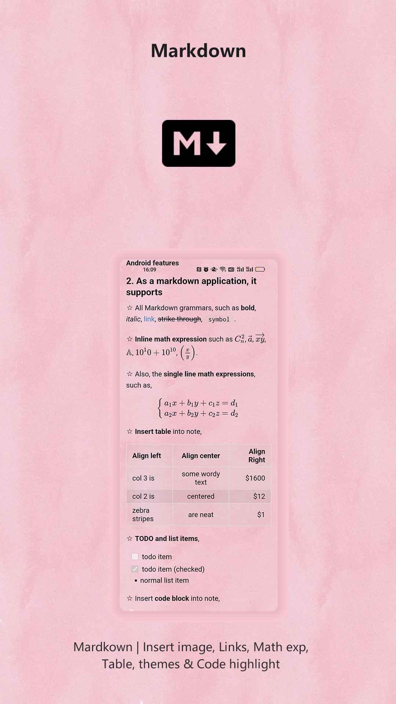
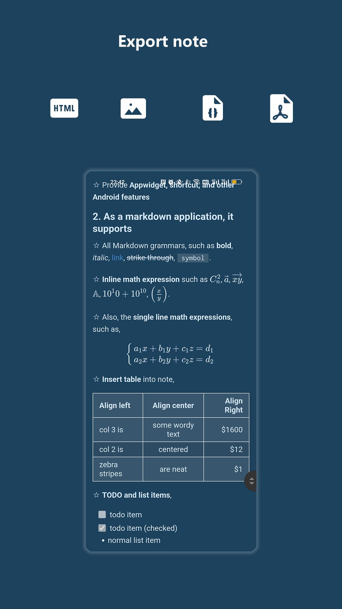

### Hi there 👋

My name is Shouheng Wang, a software engineer:

- 🔭 I’m currently working on my App **[Leaf Note](https://play.google.com/store/apps/details?id=me.shouheng.leafnote)**.
- 🌱 I’m currently learning FE & flutter & Jetpack compose & C++.
- 💼 My Android development kit: [Android-VMLib](https://github.com/Shouheng88/Android-VMLib), [iCamera](https://github.com/Shouheng88/iCamera), [Android-utils](https://github.com/Shouheng88/Android-utils), [AndroidStartup](https://github.com/Shouheng88/AndroidStartup), [Compressor](https://github.com/Shouheng88/Compressor) and [EasyMark](https://github.com/Shouheng88/EasyMark).
- 🍩 My open source projects: [MarkNote](https://github.com/Shouheng88/MarkNote), [AndroidTools](https://github.com/Shouheng88/TranslateMyApp), [OmniList](https://github.com/Shouheng88/OmniList) and [Seed](https://github.com/Shouheng88/SpringBooster).
- 📱 My published Apps:
    - **[Leaf Note](https://play.google.com/store/apps/details?id=me.shouheng.leafnote): Connecting phone and desktop, designed for cross platform, the new Mardkwon note-taking application.**
    - [MobileBox](https://play.google.com/store/apps/details?id=me.shouheng.mobilebox): A collection of useful and efficient tools.
    - [MarkNote](https://play.google.com/store/apps/details?id=me.shouheng.notepal): A markdown note-taking application.

## 👏👏👏 My new product

### LeafNote, a Markdown and note-taking application

**Leaf Note is a private Markdown and note-taking application for multi-platform collaboration via cloud sync. It's designed based on Material Design with powerful functions.** You can try the App on Google Play Store [Leaf Note](https://play.google.com/store/apps/details?id=me.shouheng.leafnote). 

Preview images of LeafNote:

**Download**

- GooglePlay: [Leaf Note](https://play.google.com/store/apps/details?id=me.shouheng.leafnote)
- CoolApk market: [言叶 —— 为跨平台而设计的 Markdown 笔记应用](http://www.coolapk.com/apk/280001).
